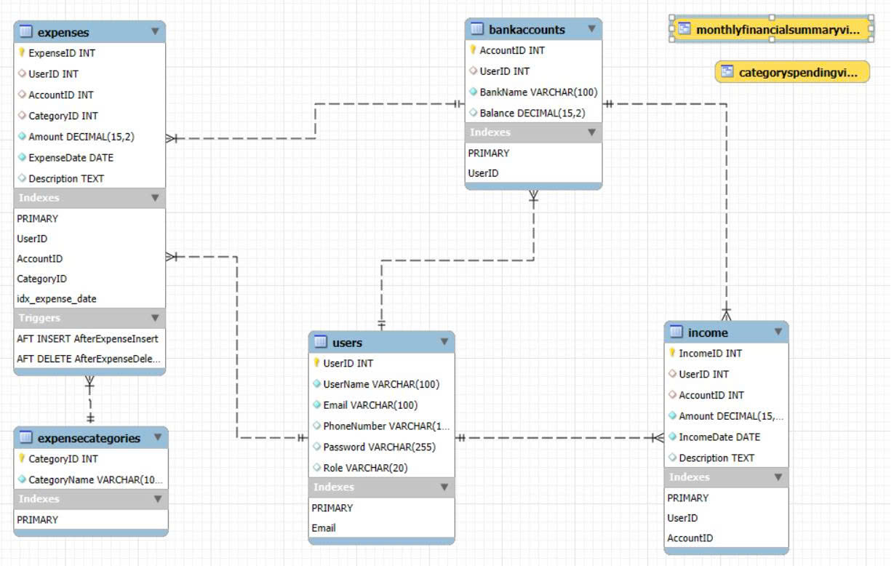

# PROJECT-13-PERSONAL-FINANCE-MANAGEMENT-SYSTEM

### Main Target:
The objective of this project is to develop a system that enables users to effectively manage personal income and expenses, track financial activities, analyze spending habits, and optimize savings through data-driven reports and alerts.

## Database Architecture (Entity-Relationship Diagram)

Below is the Entity-Relationship Diagram (ERD) illustrating the core relational schema of the Personal Finance Management system.

This project implements a highly normalized relational database schema designed for a Personal Finance Management System. It successfully incorporates core tables, foreign key constraints, and advanced database objects to ensure data integrity and performance.

### 1. Core Entities (Tables) & Attributes

* **`users` (User Profile Table)**
  * **Purpose:** Stores user authentication and profile data.
  * **Primary Key:** `UserID` (INT).
  * **Notable Attributes:** `Role` (VARCHAR) for role-based access control (Admin vs. Standard Users), `Email`, `Password`, `UserName`, and `PhoneNumber`.
  * **Indexes:** Includes an index on `Email` to optimize login queries.

* **`bankaccounts` (Financial Accounts Table)**
  * **Purpose:** Tracks the various bank accounts or wallets owned by users.
  * **Primary Key:** `AccountID` (INT).
  * **Foreign Key:** `UserID` (Links the account to a specific user).
  * **Notable Attributes:** `Balance` (DECIMAL 15,2) - Uses a decimal data type to accurately store currency values.

* **`expensecategories` (Categorization Table)**
  * **Purpose:** Acts as a lookup table for expense types (e.g., Food, Rent, Entertainment).
  * **Primary Key:** `CategoryID` (INT).

* **`expenses` (Outflow Transactions Table)**
  * **Purpose:** Records all money spent by the users.
  * **Primary Key:** `ExpenseID` (INT).
  * **Foreign Keys:** `UserID` (who spent it), `AccountID` (which bank account was deducted), and `CategoryID` (what it was spent on).
  * **Notable Attributes:** `Amount` (DECIMAL 15,2), `ExpenseDate` (DATE).

* **`income` (Inflow Transactions Table)**
  * **Purpose:** Records all money earned or deposited by the users.
  * **Primary Key:** `IncomeID` (INT).
  * **Foreign Keys:** `UserID` (who earned it) and `AccountID` (which account received the money).

---

### 2. Entity Relationships

The schema utilizes **One-to-Many (1:N)** relationships to avoid data redundancy:

* **`users` (1) ➔ (N) `bankaccounts`:** A single user can own multiple bank accounts.
* **`users` (1) ➔ (N) `expenses` & `income`:** A single user can have multiple transactions.
* **`bankaccounts` (1) ➔ (N) `expenses` & `income`:** A single bank account can be linked to multiple inflow/outflow records.
* **`expensecategories` (1) ➔ (N) `expenses`:** A single category can be applied to many different expense records.

---

### 3. Advanced Database Objects

To optimize performance and automate business logic, the database utilizes the following advanced SQL features:

* **⚡ Triggers (Data Integrity)**
  * `AfterExpenseInsert`: Automatically deducts the expense amount from the `bankaccounts.Balance` immediately after a new expense record is added.
  * `AfterExpenseDelete`: Automatically refunds the amount back to the `bankaccounts.Balance` if an expense record is deleted.

* **🔍 Indexes (Performance Tuning)**
  * `idx_expense_date`: A custom index placed on the `ExpenseDate` column to drastically speed up temporal queries and financial reporting.

* **📊 Views (Data Aggregation)**
  * `monthlyfinancialsummaryview`: A virtual table that aggregates both income and expenses, grouped by month and user.
  * `categoryspendingview`: A virtual table that joins `expenses` and `expensecategories` to output the total amount spent per category.
  * 
### 📊 4. Schema Analysis

1. **🏗️ Entity Design:** The system revolves around the `users` and `bankaccounts` entities, with financial streams bifurcated into `income` and `expenses`. This decoupling allows `expenses` to be relationally mapped to `expensecategories` for granular tracking and analytical charting, while ensuring both transactional streams strictly tie back to specific financial accounts.

2. **🔑 Normalization & Keys:** * **Referential Integrity:** The `UserID` and `AccountID` act as Foreign Keys across transactional tables, ensuring strict data isolation for individual users and accurate balance tracking per bank account.
   * **Precision Data Types:** All monetary attributes (`Balance`, `Amount`) utilize the `DECIMAL(15,2)` data type to eliminate floating-point arithmetic errors and guarantee financial accuracy.
   * **Authorization & Optimization:** The `users` table incorporates a `Role` attribute for Role-Based Access Control (RBAC) and utilizes a dedicated Index on the `Email` column to optimize authentication query performance.

3. **🔗 Cardinality:** The schema is fully compliant with the Third Normal Form (3NF), leveraging optimal One-to-Many (1:N) relationships (e.g., one user to multiple accounts; one category to multiple expense records).

4. **⚙️ Advanced Database Objects:** * **Business Logic Integration:** The `expenses` table features automated Database Triggers (`AfterExpenseInsert`, `AfterExpenseDelete`). These enforce transactional consistency by dynamically updating the `bankaccounts` balances in real-time upon any data mutation.
   * **Performance & Reporting:** A custom index (`idx_expense_date`) is applied to the `ExpenseDate` column to accelerate temporal queries. This is supported by pre-aggregated Views (`monthlyfinancialsummaryview`, `categoryspendingview`) designed for efficient reporting and data visualization.

5. **🚀 Scalability:** The modular design ensures future extensibility, ready to accommodate complex features such as inter-account `Transfers` or categorical `Budgets` without disrupting the existing relational matrix.
